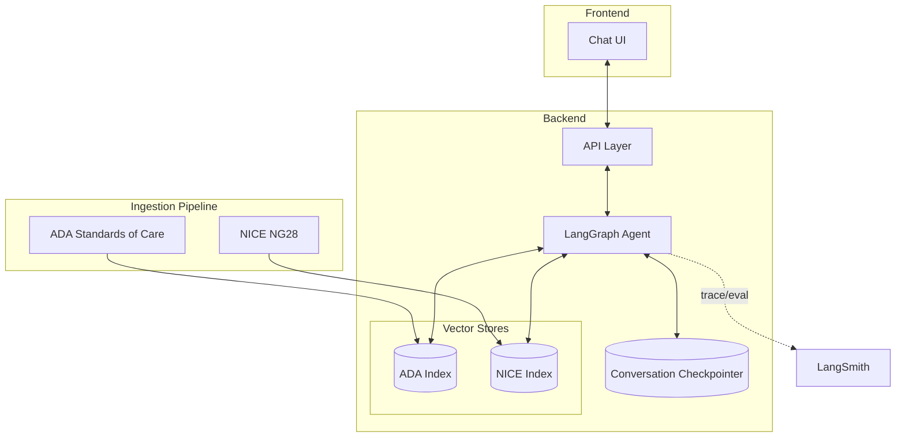
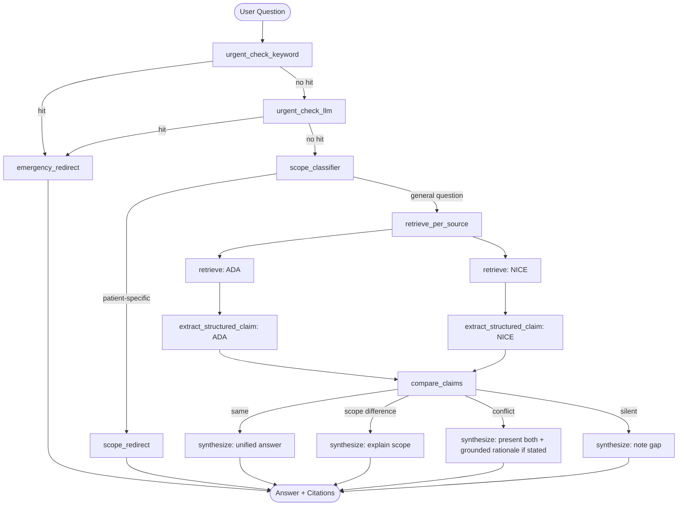

# Clinical Guideline Assistant

Grounded Q&A over Type 2 Diabetes clinical guidelines (ADA, NICE) — a LangChain/LangGraph learning project.

**Live demo**: [john-spencer-terry-clinical-guideline-assistant.streamlit.app](https://john-spencer-terry-clinical-guideline-assistant.streamlit.app/) (free-tier hosting — may cold-start on first visit; see [deploy-to-streamlit.md](deploy-to-streamlit.md))

## Design

Two sources, each indexed separately (ADA Standards of Care, NICE NG28) so the graph can retrieve from each independently and compare what they actually say, instead of pooling passages into one index and letting the model blend them.



Two guardrail nodes run before any retrieval and can short-circuit straight to a redirect: an urgent/emergency check (keyword match, then an LLM classifier fallback for paraphrased urgency, both biased toward over-triggering) and a scope check (general guideline question vs. advice for a specific person). Past the guardrails, the graph retrieves and extracts a structured claim per source, classifies the relationship between the two claims (`same` / `scope_difference` / `conflict` / `silent`), and synthesizes an answer whose shape depends on that classification — a stated rationale is only ever quoted from the source text, never inferred.



This is a learning project, not a clinical tool — the guardrails above are a reasonable first pass, not a substitute for real regulatory, legal, and clinical review.

## Setup

```bash
cp .env.example .env   # fill in OPENROUTER_API_KEY (required); LANGSMITH_API_KEY is optional
uv sync
```

Model access is via [OpenRouter](https://openrouter.ai) (OpenAI-compatible API) to keep costs low. Get a free key at [openrouter.ai/keys](https://openrouter.ai/keys). **To make sure it can't cost money**: set the key's own credit limit to $0 at [openrouter.ai/settings/keys](https://openrouter.ai/settings/keys), and leave Auto Top-Up off at [openrouter.ai/settings/credits](https://openrouter.ai/settings/credits) — with both, a request can fail but never bill.

`OPENROUTER_MODEL` in `.env` defaults to a free-tier model, but OpenRouter's free lineup rotates and individual free models get temporarily rate-limited or overloaded upstream (see Known Limitations below). Check current options at [openrouter.ai/models](https://openrouter.ai/models) (filter by `:free`) or query `GET https://openrouter.ai/api/v1/models` directly and filter for `pricing.prompt == "0"`.

## Getting the source documents

Loaders read from local files (not live scraping) that you download once:

**ADA** — save each of the 17 *Standards of Care in Diabetes—2026* sections as `data/raw/ada/section_NN.pdf`, from `https://doi.org/10.2337/dc26-s00N` (section 13 is `dc26-S013`, capital S).

**NICE** — save the NG28 PDF as `data/raw/nice/ng28.pdf` from [nice.org.uk/guidance/ng28](https://www.nice.org.uk/guidance/ng28) (resources tab).

Then build the vector indices:

```bash
uv run python -m cga.ingestion.index
```

This embeds locally via `sentence-transformers` (free, no API key, but CPU-bound — can take several minutes depending on hardware).

## Run the chat UI

```bash
uv run streamlit run app/streamlit_app.py
```

## Deploying a free demo

See [deploy-to-streamlit.md](deploy-to-streamlit.md) for hosting this on
Streamlit Community Cloud using the Chroma indices already committed under
`data/processed/`.

## Run tests

```bash
uv run pytest
```

## Run the eval suite

```bash
uv run python -m eval.run
```

`eval/dataset.py` has a starter set of hand-checked questions (not the full ~70-90 target — see Known Limitations below). Guardrail categories (`scope_guardrail`, `urgent_symptom_detection`) are graded pass/fail deterministically; grounded-recall/comparison/adversarial categories are run-and-reported for manual review until there's a reference answer to grade against.

## Project layout

- `src/cga/ingestion/` — loaders, chunking, and per-source vector indices (ADA / NICE)
- `src/cga/graph/` — LangGraph nodes: guardrails, retrieval, extraction, comparison, synthesis, `build_graph.py` wiring
- `src/cga/memory/` — conversation checkpointer (in-memory, per-process)
- `app/` — Streamlit chat UI
- `eval/` — eval dataset, evaluators, and runner
- `data/` — raw and processed guideline documents (gitignored)

## Known limitations

- **This is a learning project, not a clinical tool.** The guardrails (emergency/scope detection) are not a substitute for real regulatory, legal, and clinical review.
- **Free-tier model flakiness.** OpenRouter's `:free` models sometimes stall or return transient upstream errors (observed: `502 Service temporarily overloaded`) under back-to-back requests. `get_chat_model()` sets a 60s timeout + 2 retries, and `eval/run.py` adds inter-case delay + call-level retry with backoff — but a fully unattended run can still hit a case that needs a manual re-run. This is upstream provider behavior, not a bug in this codebase (individual isolated calls consistently succeed).
- **Retrieval quality is v1.** With `k=4` and a small local embedding model (`all-MiniLM-L6-v2`), retrieval sometimes misses the most relevant passage (e.g. pulling an unrelated section instead of the specific recommendation). Worth tuning `k`, trying a larger embedding model, or adding a reranking step.
- **Eval set is a starter, not the full plan.** The target is ~70-90 hand-verified questions across 6 categories; the current set is a smaller, hand-checked sample to prove the framework works — expand it by reading the source PDFs directly.
- **Streamlit UI hasn't been browser-verified.** No headless-browser tooling (`chromium-cli`/Playwright) was available in the dev environment used to build this — the server boots and the identical backend call was verified via CLI, but the chat UI itself (history rendering, badges) should get a manual once-over.
- **Retrieval/extraction/comparison run sequentially per source**, not fanned out in parallel — simpler and correct, but not as fast as it could be (see `build_graph.py`'s docstring).
