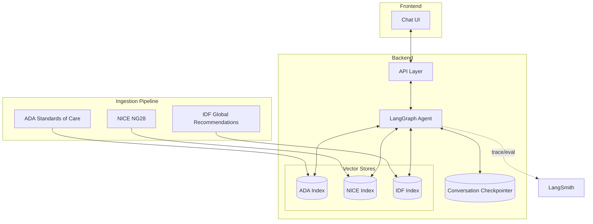
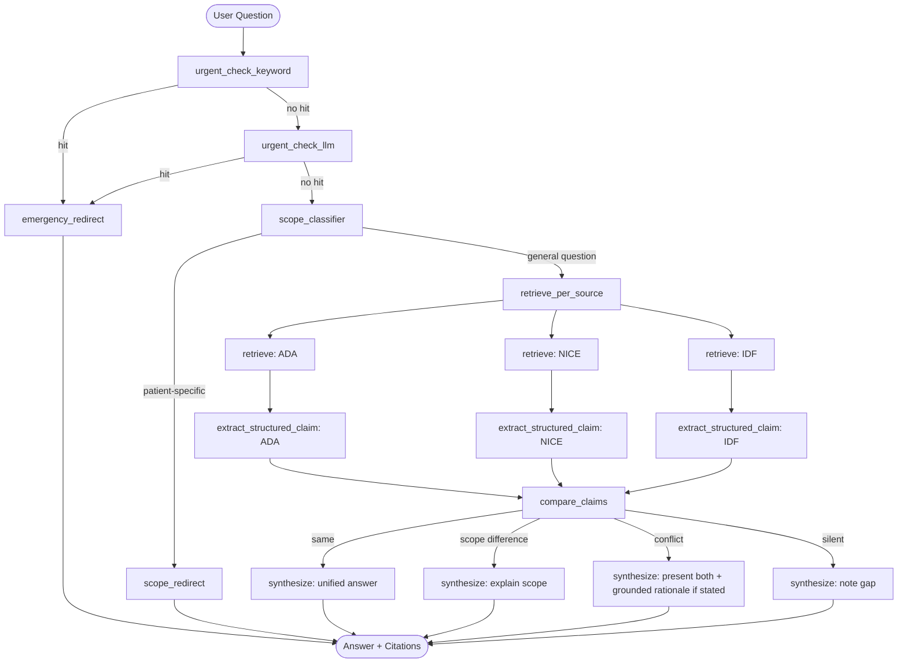

# Initial Design: Clinical Guideline Assistant (Type 2 Diabetes)

*A LangChain/LangGraph learning project — grounded Q&A over public clinical guidelines*

---

## Problem

Clinical guidelines (ADA, NICE, IDF, etc.) contain authoritative, well-structured recommendations, but they're long, dense, and scattered across multiple documents and organizations. A clinician, med student, or curious layperson who wants to know "what's the recommended first-line treatment for X" has to either already know which section of which 200-page PDF to open, or trust a generic LLM's memorized (and potentially outdated or hallucinated) answer.

There's no lightweight tool that:
- Answers guideline questions **grounded in and cited to the actual source text**, rather than paraphrased from model memory
- Surfaces **disagreement between guideline bodies** when it exists, instead of silently picking one or blending them into false consensus
- Draws a clear line between **explaining what guidelines say in general** and **giving advice about a specific patient** — a distinction that matters a lot in a medical context and is easy for a naive RAG system to blur

This project builds that tool, scoped to a single well-documented condition (Type 2 Diabetes), as a vehicle for learning LangChain and LangGraph's core primitives against a real, non-trivial problem rather than tutorial toy data.

---

## Solution Overview

### Summary

A conversational assistant that answers questions about Type 2 Diabetes diagnosis, screening, treatment, and complications by retrieving from three public clinical guideline sources (ADA, NICE, IDF), comparing what each source says, and generating a cited, grounded answer. The system:

- Routes urgent/emergency-sounding messages to a redirect instead of answering from guidelines
- Routes patient-specific requests to a redirect/reframe instead of giving individualized advice
- Retrieves independently per source, extracts structured claims, classifies agreement vs. disagreement, and synthesizes an answer whose shape depends on that classification
- Cites every claim back to a specific guideline passage
- Is evaluated against a hand-built test set covering every one of the above behaviors, not just "does it sound plausible"

The primary goal is **learning LangChain/LangGraph deeply**, not shipping a production medical tool — see [Safety & Scope](#safety--scope-guardrails) for why the guardrails exist and their limits.

### Data Sources

| Source | Character | Role in the project |
|---|---|---|
| **ADA Standards of Care in Diabetes — 2026** | Comprehensive, US-centric, annual living document, published as multiple journal-article sections | Primary/anchor source, full scope (diagnosis → complications) |
| **NICE NG28** (Type 2 diabetes in adults: management) | UK NHS guideline with explicit numbered recommendations (e.g. "1.9.3") | Citation granularity, structured extraction (tables), recency tracking |
| **IDF Global Clinical Practice Recommendations** | Global/resource-context-aware | Genuine cross-source disagreement material (drug-access-dependent recommendations differ from ADA/NICE) |

**Scope:** full guideline scope — diagnosis, screening, pharmacologic/non-pharmacologic treatment, and complications (retinopathy, nephropathy, neuropathy, cardiovascular risk) — chosen deliberately because each area has a different content shape (short/factual, tabular, algorithmic/branching, long narrative), which stress-tests chunking and retrieval strategy across the board instead of over-fitting to one content type.

### Backend

The backend is the actual learning surface for this project. It has four layers:

**1. Ingestion & indexing**
- Programmatic ingestion of ADA (multi-section journal articles), NICE (PDF with numbered recommendations), and IDF (PDF/HTML) — not hand-copied text, since the point is to build a real pipeline and because ADA alone runs hundreds of pages.
- Chunking strategy varies by content shape: narrative sections can use semantic/recursive chunking; tables (screening ages, dosing) need structure-aware extraction rather than naive paragraph splitting, since a chunked-apart table row loses its meaning.
- Metadata tagged per chunk: source, section, recommendation number (where available), publication/last-updated date — needed for citation granularity and recency flags.
- Embedded into a vector store, indexed **separately per source** rather than one pooled index, since the disagreement-detection flow needs to retrieve from each source independently before comparing.

**2. Guardrail layer (runs before retrieval)**
Two short-circuit checks that can terminate the graph early, in priority order:
- **Urgent/emergency detection** — hybrid: a fast keyword/pattern check first (chest pain, loss of consciousness, DKA symptoms, dangerous glucose values, self-harm language), falling back to a lightweight LLM classifier only when the keyword check doesn't trigger, to catch paraphrased urgency ("haven't been able to catch my breath since this morning"). Biased toward over-triggering, since a false positive costs a mildly annoying redirect while a false negative could mean an emergency gets a calm RAG answer.
- **Patient-specific scope detection** — a classifier distinguishing "what do the guidelines say about this population" (answerable) from "what should I/my family member personally do" (not answerable). Deliberately tuned to not over-trigger on conversational-but-general phrasing ("if I have CKD, does that change treatment?").

**3. Retrieval, comparison & synthesis (the core agentic flow)**
- Retrieve independently from ADA, NICE, and IDF for the question.
- Extract a structured claim per source (recommendation, applicable population, evidence grade, and an optional `stated_rationale` field populated only when the source text itself gives a reason).
- Classify the relationship between the three claims: **same** / **scope difference** / **genuine conflict** / **silent** (a source doesn't address it). This node's job is classification only — not resolution or friendly hedging — to keep it precise.
- Synthesize a final answer whose structure depends on the classification:
  - *Same* → one clean cited answer.
  - *Scope difference* → explain the difference explicitly rather than flattening it.
  - *Conflict* → present both positions without picking a winner; explain **why** only if a source's text states a reason (never inferred — if no rationale is in the text, the answer says so explicitly).
  - *Silent* → say so plainly rather than let the model fill the gap.

**4. Memory**
Conversation state (resolved topic, entities like "the patient population under discussion") persists across turns via a LangGraph checkpointer, so follow-ups like "what about for someone with a penicillin allergy" carry context without re-stating it.

### Frontend

Minimal by design, since the learning goal is backend/LangChain depth, not UI polish:
- Simple chat interface: message history, streamed response, and **visible citations** (source + section/recommendation number) rendered under each answer — this is the one UI element worth investing in, since "can the user verify the claim" is the whole point of the grounding work.
- A lightweight visual indicator when an answer involved a disagreement classification (e.g. a small "guidelines differ here" badge), since that's a distinguishing feature worth surfacing rather than burying in prose.
- Redirect responses (emergency / patient-specific) rendered distinctly from normal answers, so it's visually clear the system took a different path.
- Stretch: a small trace/debug panel showing which sources were retrieved and how the comparison node classified them — useful for your own development and for demoing the LangGraph routing to others.

### Architecture Diagram

### LangGraph Flow

### Disagreement Handling

- **Type 1 — genuine clinical disagreement**: sources actually recommend different things for the same scenario (e.g. NICE's early dual-therapy push vs. ADA's more staged approach). Real signal, worth surfacing.
- **Type 2 — apparent disagreement**: different population, scope, or phrasing rather than a real conflict (e.g. different eGFR thresholds framed differently). Needs to be explained as a scope difference, not flattened into false consensus or inflated into false conflict.
- **Grounding rule for "why"**: the synthesis step may explain *why* sources differ only when the source text itself states a rationale (tracked via a `stated_rationale` field on the structured claim). If no rationale is present in the text, the system says so explicitly rather than inferring one — this is a hard constraint on the synthesis prompt, not a soft preference.

### Safety & Scope Guardrails

- **Emergency detection** (hybrid keyword + LLM, keyword-first) short-circuits the graph entirely — no retrieval, no citation, just a direct redirect to emergency care.
- **Patient-specific scope routing** distinguishes general guideline questions from requests for individualized advice, reframing rather than flatly refusing where possible (e.g. offering the general version of the question back).
- **Defense in depth**: the synthesis prompt itself independently states the system's role ("explains what published guidelines say; does not provide individualized medical advice") so a borderline case that slips past the classifier is still self-limited at generation time.
- These guardrails are designed for a **learning project**, not a deployed clinical tool — they are not a substitute for real regulatory, legal, and clinical review that would be required before any real-world use.

### Evaluation

A hand-built (not LLM-generated) test set of ~70-90 questions, read directly from the source guidelines, covering:

| Category | Count | Tests |
|---|---|---|
| Grounded factual recall | ~15-20 | Baseline retrieval quality; exact fact + correct citation |
| Cross-source comparison | ~10-15 | Correct agree/scope-diff/conflict classification; grounded-rationale rule |
| Structured extraction | ~10 | Exact match against manually verified table data |
| Scope guardrail | ~15-20 | Correct trigger/no-trigger, including hard conversational-but-general boundary cases |
| Urgent-symptom detection | ~15-20 | Keyword-stage vs. LLM-stage catch rate, tracked separately |
| Adversarial/edge cases | ~10 | Off-topic questions, hypothetical-reframing attempts to bypass scope guardrail |

Run as a LangSmith eval dataset with typed inputs/expected outputs — deterministic/structural evaluators for most categories, LLM-as-judge only where needed (rationale-groundedness checks).

---

## Implementation Plan

### Phase 0 — Setup
- [ ] Stand up project environment (Python, LangChain, LangGraph, LangSmith tracing enabled from day one — not bolted on later)
- [ ] Choose and provision a vector store (start simple — local Chroma or similar — swap later if needed)
- [ ] Confirm licensing/usage terms for ADA, NICE, and IDF content before ingesting (educational/noncommercial use)

### Phase 1 — Ingestion pipeline
- [ ] Write loaders for ADA's multi-section journal articles (loop over section URLs, not a single PDF)
- [ ] Write loader for NICE NG28 PDF, preserving numbered-recommendation structure
- [ ] Write loader for IDF global recommendations document
- [ ] Design and implement content-aware chunking (narrative vs. tabular vs. algorithmic sections)
- [ ] Tag chunks with metadata: source, section, recommendation number, last-updated date
- [ ] Build three separate vector indices (ADA / NICE / IDF)

### Phase 2 — v1: Single-source grounded Q&A
- [ ] Basic retrieval chain against one index (start with ADA)
- [ ] Prompt design enforcing "answer only from retrieved context"
- [ ] Citation formatting (source + section/recommendation number)
- [ ] Manual smoke-testing against a handful of known-answer questions

### Phase 3 — v2: Structured extraction
- [ ] Define Pydantic schema for a guideline claim (recommendation, population, evidence grade, stated_rationale)
- [ ] Apply structured extraction to tabular content (screening ages, dosing thresholds) specifically
- [ ] Validate extraction accuracy against manually-read source tables

### Phase 4 — v3: Multi-source comparison (core agentic flow)
- [ ] Extend retrieval to run independently across all three indices
- [ ] Build the `compare_claims` classification node (same / scope-diff / conflict / silent)
- [ ] Build branch-specific synthesis prompts/nodes for each classification outcome
- [ ] Implement the grounded-rationale constraint (`stated_rationale` field, "don't infer" prompt rule)

### Phase 5 — v4: Guardrails
- [ ] Build keyword list and pattern matcher for urgent-symptom stage 1
- [ ] Build lightweight LLM classifier for urgent-symptom stage 2 (small/cheap model, biased toward over-triggering)
- [ ] Build patient-specific scope classifier, tuned against boundary-case examples
- [ ] Wire both as short-circuiting nodes at the front of the LangGraph graph
- [ ] Add defense-in-depth role constraint to the synthesis system prompt

### Phase 6 — v5: Memory
- [ ] Add LangGraph checkpointer for conversation state
- [ ] Test multi-turn follow-ups that depend on prior-turn context (e.g. comorbidity carried across questions)

### Phase 7 — Evaluation
- [ ] Hand-write the ~70-90 question eval set directly from source guidelines, across all six categories
- [ ] Build LangSmith eval dataset with typed inputs/expected outputs
- [ ] Implement deterministic evaluators (exact/structural match) for factual recall, extraction, guardrail categories
- [ ] Implement LLM-as-judge evaluator for rationale-groundedness in comparison category
- [ ] Run full eval pass, identify failure clusters, iterate on prompts/chunking/routing

### Phase 8 — Frontend
- [ ] Basic chat UI with streamed responses
- [ ] Citation rendering under each answer
- [ ] Visual indicator for disagreement-classified answers
- [ ] Distinct styling for redirect responses (emergency / scope)
- [ ] Stretch: trace/debug panel showing per-source retrieval and classification outcome

### Phase 9 — Polish & iteration
- [ ] Re-run eval set after any prompt/architecture change to catch regressions
- [ ] Expand keyword lists / boundary-case examples based on observed eval failures
- [ ] Document known limitations clearly (not a clinical tool, learning project only)